# Key User Adaptation for SAPUI5 Applications - Introduction
<!-- description --> Adapt the user interface of an SAPUI5 app for other users with the key user adaptation feature of SAPUI5 flexibility.

## You will learn
  - How to change the UI of an SAPUI5 Fiori app.
  - How to activate a new app version with your changes.
  - How to restore the original app.

## Intro
Different users work with SAPUI5 applications differently - e.g. depending on which role they have. Ideally, an end user should only see what is relevant for their work in the most intuitive way possible. Since this can greatly vary for each business, **key users** can tailor an app according to different needs. They know what the end users need from the application but don't necessarily have a technical background. With [key user adaptation](https://help.sap.com/docs/UI5_FLEXIBILITY/430e2c1a4ff241bc8162df4bf51e0730/328a550137344514ae085b924180d078.html?language=en-US), they can change the user interface of SAPUI5 Fiori apps directly in the Fiori launchpad intuitively and without having to write new code. In this tutorial you will get to try out key user adaptation in a demo app.

---

### Start key user adaptation

1. Go to the [SAPUI5 Demo Kit](https://ui5.sap.com/#/demoapps), and open the **Key User Adaptation** demo app under *SAPUI5 Flexibility Demo Apps*.

2. Go to the user actions menu of the app (in this demo app you are the *Default User*).

    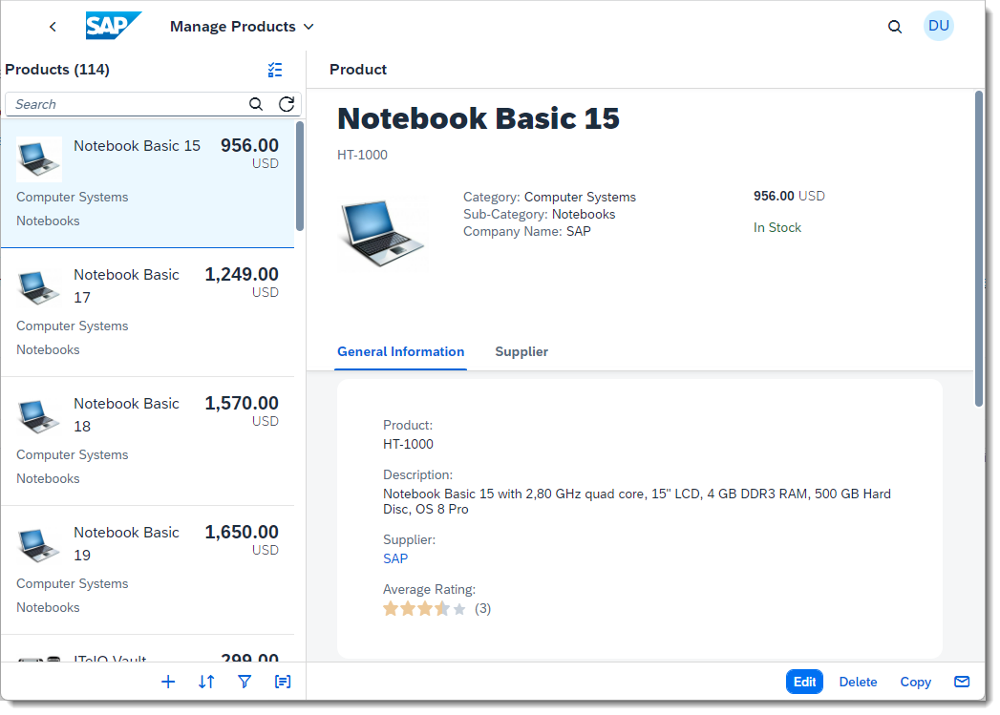

3. Choose **Adapt UI**. In real apps, only key users with specific authorization see this option.

    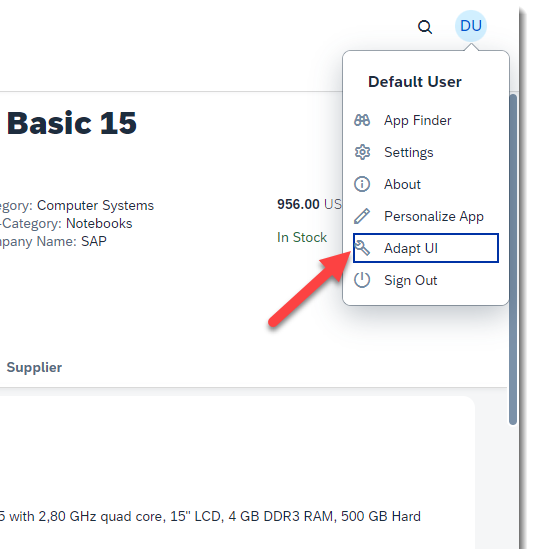

4. Well done! Your app is now ready to be adapted. Make sure that *Original App* is selected on the top left (in the toolbar) - if you never made any adaptations to this app, this will be the default case.

    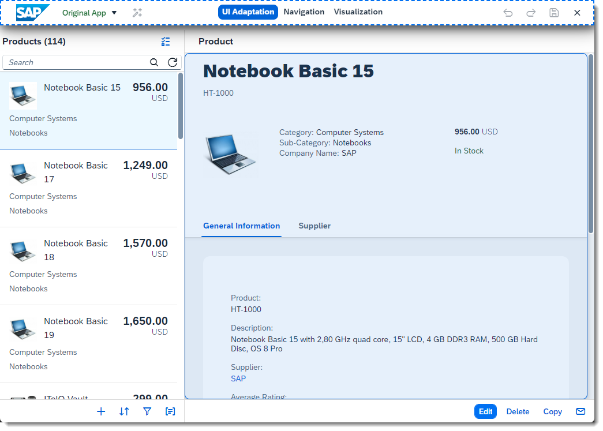

> On real SAPUI5 applications, this flow is the same - but to enable *Adapt UI* some conditions need to be fulfilled. Please follow [this link](https://help.sap.com/docs/UI5_FLEXIBILITY/430e2c1a4ff241bc8162df4bf51e0730/328a550137344514ae085b924180d078.html?language=en-US#platform-specific-documentation-on-key-user-adaptation) to find the right documentation for your platform.

### Rename a field

1. Right-click on a field.

2. Select **Rename**

    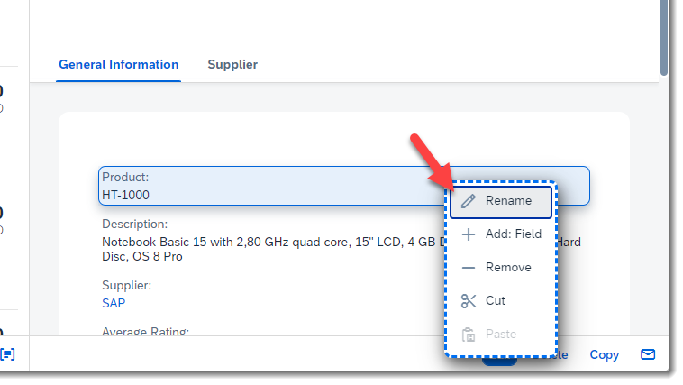

3. The field name is highlighted in blue. Overwrite the text.

    

4. Click anywhere outside the field to confirm your change.
   
    >You can also start a rename by double-clicking on the field text.

### Move a field

1. You can easily move fields by using drag and drop. Move the field *Company Name* to the end of the group as shown below.

    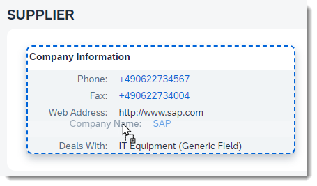

    > Many types of controls can be moved using drag & drop (the mouse cursor changes when you hover over them).

2. You can also move controls using **Cut** and **Paste** on the context menu.

    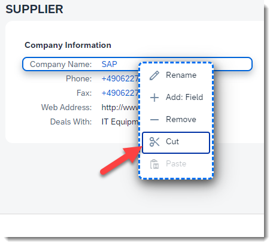
    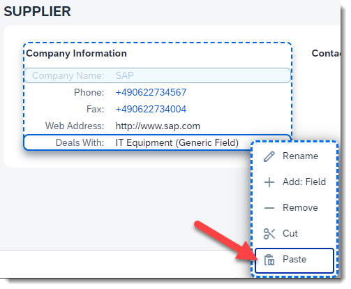

### Activate your version and exit key user adaptation

1. Press the **Activate New Version** button in the toolbar.

    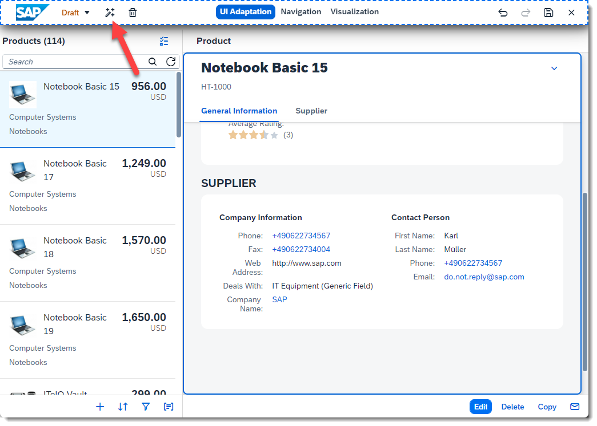

2. Enter a name for your version, e.g. "My First Version" and press **Confirm**.
   
    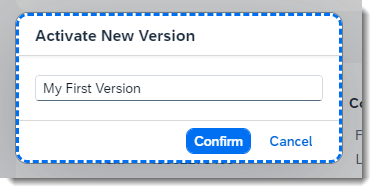

    > If you just want to save your changes without making them visible to other users yet, simply press **Save** on the toolbar. The changes will then be saved to the *Draft*. 

3. Now press the **Exit** button in the toolbar to leave key user adaptation.

    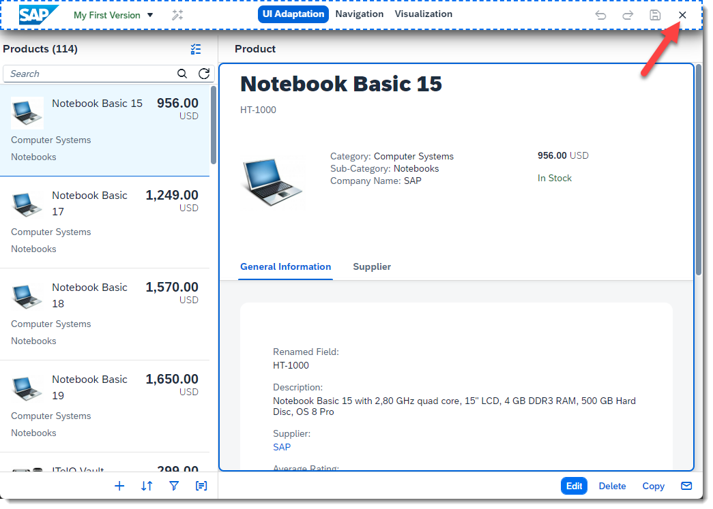

---

Congratulations! You have just made your first key user adaptations and activated your first version. In a real system, all end users would see your version of the app: a tailored UI of the Manage Products app to work more efficiently.

>Notice that, if you reload the app, your changes will still be there.

### Restoring the app to its original state

1. Start key user adaptation again (like in Step 1).
   
2. On the Version drop down (left side of the toolbar), select *Original App*.

    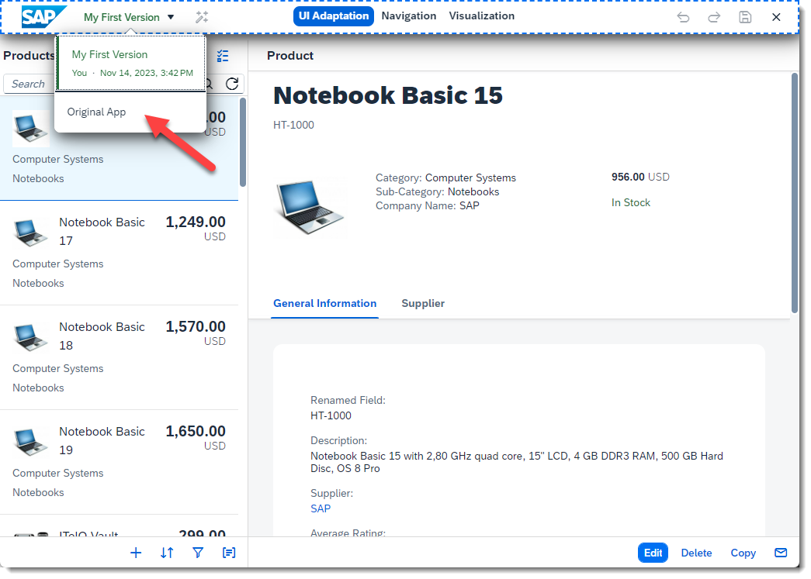

3. Now press **Activate New Version**, enter a suitable name like "Back to Original App" and press **Confirm**.

    

4. Finally, press the **Exit** button in the toolbar to leave key user adaptation.

Now the application is back to how it originally was. Feel free to try out other functions before moving to the next tutorial, where you will learn more details on how key user adaptation works and what it can achieve.

>For the SAPUI5 Demokit apps, the key user changes are saved in your browser's local storage. If you create too many versions and want to get a clean state, you can remove all entries starting with *sap.ui.fl* from your browser's local storage.